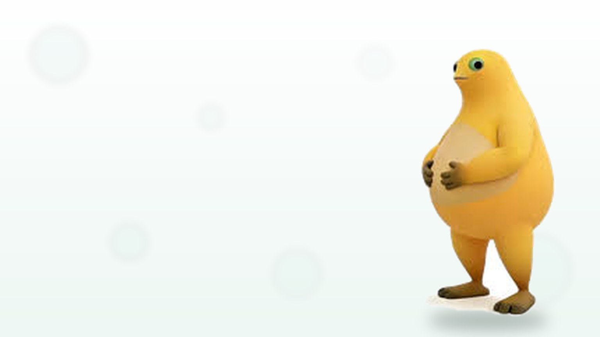

# nai

**Nai (奶蛙) mascot appearance layer for the DeepSeek Harness Web GUI** — the original milk-frog photo, shipped inside the plugin, worn by the harness as its background, its brand mark, and its settings surface.




## What it does

- **Chat background** — the shipped 16:9 artwork is mounted as a fixed, click-through layer behind the whole GUI. The shell's surface tokens (`--dsw-alias-bg-base`, `--dsw-specific-sidebar-fill`, `--dsw-alias-bg-layer-1/2`) are faded to the configured opacity so the wallpaper actually shows through instead of hiding behind an opaque shell, and the root background is cleared for it.
- **Controls** — opacity of the shell surfaces, wallpaper blur, a dark scrim for readability, and `background-position`, all applied live.
- **Brand mark** — the square Nai avatar replaces the logo in the sidebar and the conversation hero through the stock `sidebar.brand.mark` and `conversation.hero.brand.mark` slots.
- **Settings section** — a 「奶蛙美化 Nai」 page in Settings edits everything, with previews of both artworks, and applies on save.
- **Host half** — serves the artwork and the config from the local DSH web server (`/api/nai/...`), so the browser never reaches outside, and stamps the config into the HTML so the GUI comes up already dressed.

## Install

```sh
dsh plugin --profile web add bauerelizabeth07139/nai
```

Any spec the plugin manager accepts works — a GitHub shorthand, a full git URL, or a local checkout:

```sh
dsh plugin --profile web add https://github.com/bauerelizabeth07139/nai.git
dsh plugin --profile web add C:\path\to\nai
```

Then open **Settings → 奶蛙美化 Nai**. Uninstall with `dsh plugin --profile web remove nai`.

## Configuration

The config lives at `$DSH_HOME/nai.json` (default `~/.dsh/nai.json`) and is edited by the Settings section; it is also reachable over HTTP.

| Field | Default | Meaning |
|---|---|---|
| `wallpaper` | `true` | Wear the Nai artwork as the GUI background |
| `brand` | `true` | Replace the sidebar and hero logos with the Nai avatar |
| `surfaceOpacity` | `88` | Shell surface opacity in % — higher means a more opaque shell, a subtler wallpaper (40–100) |
| `blur` | `0` | Gaussian blur applied to the wallpaper, in px (0–24) |
| `scrim` | `35` | Dark scrim over the wallpaper for readable transcript, in % (0–90) |
| `position` | `center` | Wallpaper `background-position`: `center`, `left`, `right`, `top`, `bottom` |

| Route | Method | Purpose |
|---|---|---|
| `/api/nai/config` | `GET` / `PUT` | Read / write the config (writes are same-origin only) |
| `/api/nai/wallpaper` | `GET` | The 16:9 background artwork |
| `/api/nai/mark` | `GET` | The square avatar artwork |

Every value is clamped server-side; unknown keys are dropped.

## Artwork provenance

All three shipped images come from **one original photo** (`nai.jpg`, shipped byte for byte as given):

- `assets/nai.jpg` — the original file, unmodified.
- `assets/nai-mark.jpg` — a 160×160 crop of the character (head to hands) from that photo, resampled to 512×512.
- `assets/nai-wallpaper.jpg` — 1536×864, the character flood-filled off its white backdrop and composited onto a light 16:9 canvas with a soft ground shadow and faint bokeh.

No AI re-rendering: the character in every shipped asset is the one from the photo.

## Development

No build step, no runtime dependencies (React and `@deepseek-ai/cordis` are peers supplied by the harness).

```sh
npm test   # node >= 22: host routes/config/stamp tests + client DOM-stub tests
```

- `lib/index.js` — the host half: config file, three routes, HTML boot stamp.
- `lib/client.js` — the browser half: wallpaper layer, surface fade, brand-mark slots, Settings section.
- `cordis.patch.yml` — the loader row that makes both halves load.

---

## 中文

**DeepSeek Harness 网页端的奶蛙美化形象插件** —— 一张奶蛙原图随插件一起分发,由 Harness 当作背景、品牌标识与设置项穿在身上。

### 功能

- **聊天背景**:内置 16:9 壁纸作为不可点击的全屏背景层;同时把界面的表面色令牌(`--dsw-alias-bg-base`、`--dsw-specific-sidebar-fill`、`--dsw-alias-bg-layer-1/2`)按设定透明度调淡,背景才能真正透出来,而不是被不透明的界面挡住。
- **可调参数**:界面不透明度、背景模糊、暗色遮罩、壁纸位置,改动即时生效。
- **品牌标识**:通过官方的 `sidebar.brand.mark` 与 `conversation.hero.brand.mark` 插槽,把侧栏与会话标题处的 logo 换成奶蛙方形头像。
- **设置页**:Settings 里的「奶蛙美化 Nai」页面提供两张素材预览与全部开关,保存即生效。
- **宿主半**:由本地 DSH Web 服务直接提供素材与配置接口(`/api/nai/...`),浏览器无需访问外部网络;配置同时被盖进 HTML,页面一打开就是美化后的样子。

### 安装

```sh
dsh plugin --profile web add bauerelizabeth07139/nai
```

随后打开 **Settings → 奶蛙美化 Nai**。卸载:`dsh plugin --profile web remove nai`。

### 配置

配置文件为 `$DSH_HOME/nai.json`(默认 `~/.dsh/nai.json`),字段与取值范围见上方英文表格;服务端会做钳制并丢弃未知字段。

### 素材来源

三张素材全部来自**同一张原图**(插件内的 `nai.jpg` 即原文件、逐字节一致):头像由原图裁切并重采样,壁纸则把原图中的角色从白底上抠出、贴到 16:9 浅色画布上并加柔和落影。全程没有 AI 重绘。

### 开发

```sh
npm test   # 需要 node >= 22,无任何运行时依赖
```

## License

[MIT](LICENSE)
